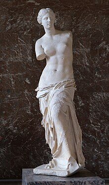
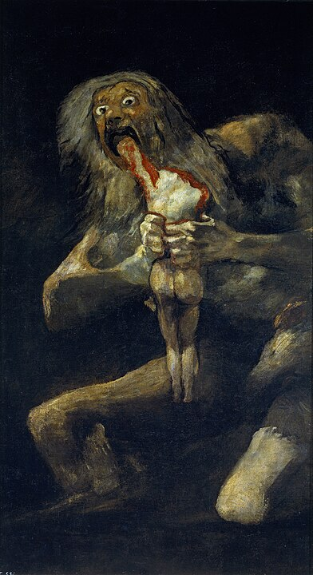

<!--

author: Moritz Riemann
email:  riemann@philsem.uni-kiel.de
version: 0.1
language: en
narrator: UK English Female

\-->

# Hesiod: Theogonie & Werke und Tage

**Dozent:**

* Moritz Riemann (riemann@philsem.uni-kiel.de)

**Zeit und Raum:** Dienstag, 12-14, LMS11a - R.EG.004

**Inhalt**

* Geschichte der Philosophie: Antike (BA 2)
* Einführung in die theoretische Philosophie (BA 3)
* Theoretische Philosophie: Vertiefung (BA 5)
* Philosophische Reflexion und ethische Urteilskraft

## "Regierungserklärung"

1. Die Teilnahme am Seminar erfordert die vorbereitende, gründliche Lektüre der Texte.
2. Eine regelmäßige und aktive Teilnahme aller Seminarteilnehmenden ist Voraussetzung für ein gelingendes Seminar.
3. Philosophische Seminare leben vom diskursiven Austausch. Nehmt in Euren Diskussionsbeiträgen auf den Text und aufeinander Bezug, lasst einander ausreden und vermeidet lange, abschweifende Exkurse.
4. Meine Sprechsstunde (Mittwoch 16:15) ist offen für alle Anliegen, es ist keine Anmeldung erforderlich.
5. Bevor Ihr eine Email schreibt: Seht im Seminarplan nach, ob die gesuchte Information dort zu finden ist.

## Prüfungsleistungen

**BA 2:**

* Ergebnisprotokoll im Umfang von 2-3 Seiten. Das Protokoll soll die wesentlichen Inhalte einer Seminarssitzung ergebnisorientiert und systematisch zusammenfassen. Die Anmeldung zum Protokoll erfolgt zu Beginn der Sitzung. Es ist bis Montag, 12 Uhr nach der protokollierten Sitzung im OLAT-Teilnehmerordner hochzuladen und dient damit der Rekapitulation zu Beginn der folgenden Sitzung. Beachten Sie die Handreichung zum Erstellen eines Protokolls im OLAT-Ordner

**BA 3:**

* Take-Home-Klausur im Umfang von 5-6 Seiten. Die Aufgabenstellung erfolgt in der letzten Sitzung. Abgabe: 30.09.2024

**BA 5:**

* Hausarbeit im Umfang von 10 Textseiten. Individuelle und eigenständige Themenfindung aus dem Themenbereich des Seminars. Ein persönliches Gespräch mit dem Dozenten (Sprechstunde) zur Vorbereitung ist Voraussetzung für die Annahme der Arbeit. Abgabe: 30.09.2024

**PHF-phil-WP:**

* Essay im Umfang von 5-7 Textseiten. Individuelle und eigenständige Themenfindung aus dem Themenbereich des Seminars. Ein persönliches Gespräch mit dem Dozenten (Sprechstunde) zur Vorbereitung ist Voraussetzung für die Annahme der Arbeit. Abgabe: 30.09.2024

## Literatur

**Textgrundlage für das Seminar**

Textgrundlage für die *Theogonie* und *Werke und Tage* bildet die Übersetzung von Albert von Schirnding:

* Hesiod: Theogonie / Werke und Tage. Sammlung Tusculum. Berlin 2012 (Bitte beschaffen. Als ebook im Campusnetz der UB erhältlich)
* Ergänzend: Theogonie. Übersetzt und erläutert von Raoul Schrott. Frankfurt a. Main: S. Fischer 2023.
* Hesiod: Works and Days. Translated A.E.Stallings. Penguin Classics 2018.
* Hesiod: Theogony and Works and Days. Translated by Kimberly Johnson. Northwestern University Press, 2017.

**Zur Person**

* World History Encyclopedia (auf Deutsch): Hesiod | [Hier](https://www.worldhistory.org/trans/de/1-785/hesiod/).
* Projekt Gutenberg: Hesiod | [Hier](https://www.projekt-gutenberg.org/autoren/namen/hesiod.html).

**Textausgaben**

* Hesiod: Theogonie. Übersetzt und erläutert von Raoul Schrott. Carl Hanser Verlag, München 2014, ISBN 978-3-446-24615-7.
* Otto Schönberger (Hrsg.): Hesiod „Werke und Tage“, Griechisch / Deutsch. Philipp Reclam jun., Stuttgart 2004, ISBN 3-15-009445-3 (paraphrasierend).
* Otto Schönberger (Hrsg.): Hesiod „Theogonie“, Griechisch / Deutsch. Philipp Reclam jun., Stuttgart 2002, ISBN 3-15-009763-0 (paraphrasierend).
* Hesiod, Theogonie. Werke und Tage. Griechisch und deutsch, herausgegeben und übersetzt von Albert von Schirnding. 3. Auflage, Artemis und Winkler, Zürich/Düsseldorf 2002.
* Friedrich Solmsen (Hrsg.): Hesiodi Theogonia Opera et Dies Scvtvm. Oxford Classical Texts. 3. Auflage, Oxford 1990, ISBN 978-0-19-814071-9.
* Hesiod. Sämtliche Gedichte. Theogonie. Erga. Frauenkataloge. Übersetzt und erläutert von Walter Marg. Zürich/Stuttgart 1970.
* Reinhold Merkelbach, Martin L. West (Hrsg.): Fragmenta Hesiodea. Clarendon Press, Oxford 1967.
* Hesiod: Sämtliche Werke (Theogonie, Werke und Tage, Der Schild des Herakles) Deutsch von Thassilo von Scheffer. Dieterich’sche Verlagsbuchhandlung (= Sammlung Dieterich Band 38), Wiesbaden 1947.
* Hesiods Werke und Tage. Griechisch und Deutsch. Übertragen von Helmut von den Steinen. Mainzer Presse, Mainz 1930.

**Sekundärliteratur**

* Andrea Ercolani, Luigi Enrico Rossi: Hesiod. In: Bernhard Zimmermann (Hrsg.): Handbuch der griechischen Literatur der Antike, Band 1: Die Literatur der archaischen und klassischen Zeit. C. H. Beck, München 2011, ISBN 978-3-406-57673-7, S. 78–123.
* Cairns, D. L.: Aidos. The Psychology and Ethics of Honour and Shame in Ancient Greek Literature, Oxford 1993: Clarendon Press, pp. 79 – 83.
* Ernst Heitsch (Hrsg.): Hesiod (= Wege der Forschung 44). Wissenschaftliche Buchgesellschaft, Darmstadt 1966.
* Ernst-Richard Schwinge: Hesiods Geschichte von den Menschengeschlechtern (Erg. 106-201). In: Gymnasium 119, 2012, S. 425–448.
* Hermann Fränkel: Dichtung und Philosophie des frühen Griechentums. 5. Auflage, C. H. Beck, München 2006, ISBN 3-406-37716-5, S. 104–146.
* Kraus, W.: “Die Aspekte des Geschehens im Prometheus“, in: ders., Aus Allem Eines. Studien  zur antiken Geistesgeschichte, Heidelberg 1984: L. Stiehm Verlag, S. 213.
* Jaeger, W.: Die Theologie der frühen griechischen Denker (ursprünglich unter dem Titel  The Theology of the Early Greek Philosophers), Stuttgart 1953: Kohlhammer.
* Mait Kõiv: A Note on the Dating of Hesiod. In: The Classical Quarterly 61, 2011, S. 355–377.
* Müller, R.: Die Entdeckung  der Kultur. Antike Theorien über Ursprung und Entwicklung der Kultur von Homer bis Seneca,  Düsseldorf und Zürich 2003: Artemis und Winkler (Patmos Verlag), pp. 30 – 41.
* Nilsson, M. P.: Geschichte der griechischen Religion, 1. Band, 4.  Auflage, München 1976: C. H. Beck, pp. 620 – 625.
* Paul Dräger: Untersuchungen zu den Frauenkatalogen Hesiods. Steiner, Stuttgart 1997, ISBN 3-515-07028-1.
* Robert D. Lamberton: Hesiod. Yale University Press, New Haven 1988, ISBN 0-300-04068-7.
* Zeller, D.: Die Worte der sieben Weisen – ein Zeugnis volkstümlicher  griechischer Ethik“, in: Althoff, J. und D. Zeller (Hrsg.): Die Worte der Sieben Weisen,  griechisch/deutsch, Darmstadt 2006: Wissenschaftliche Buchgesellschaft, pp. 105 – 158.

## Semesterplan

| Datum | Thema, Inhalt |
|-------|---------------|
| 18.04.2024 | Eröffnung, Organisatorisches |
| 25.04.2024 | Sitzung entfallen  |
| 02.05.2024 | Theogonie: Die Musen; Chaos, Gaia und die ersten Götter (VV. 1-210) |
| 09.05.2024 | Keine Sitzung: Feiertag |
| 16.05.2024 | Theogonie: Die Kinder der Nacht; Die Kinder des Meeres; Die Kinder des Ringstroms; Andere Titanen; Hekate (VV. 211-452) |
| 23.05.2024 | Theogonie: Kronos; Prometheus; Der Kampf gegen die Titanen; Der Tartaros (VV. 453-819)  |
| 30.05.2024 | Theogonie: Typhoeus; Die Kinder des Zeus; Die Kinder der Göttinnen und Menschen (VV. 820-Ende) |
| 06.06.2024 | Werke und Tage |
| 13.06.2024 | Werke und Tage |
| 20.06.2024 | Werke und Tage |
| 27.06.2024 | Keine Sitzung: Selbststudium |
| 04.07.2024 | Werke und Tage (evtl. Katalog der Frauen) |
| 11.07.2024 | Abschlussdiskussion |

## Sitzung 18.04.2024

### Hesiod Leben, Werk, Rezeption

* Geboren irgendwann vor 700 v. Chr. vermutlich in Askra / Böotien
* Über das Leben ist nichts überliefert, außer ein paar Verse in seinen eigenen Texten - deren Informationsgehalt ist allerdings umstritten

### Hinweise für das Verfassen von Sitzungsprotokollen im Modul BA 2

#### I. Grundformen und Funktionen

1. Wortprotokoll, Verbalprotokoll – direkte Dokumentation des mündlichen Wortlauts z.B. bei Gerichtsverhandlungen
2. Verlaufsprotokoll, Verhandlungsprotokoll – Protokoll des Gesprächsprozesses. Wie kam es zu Beschlüssen oder Ergebnissen? Wie lauteten die Argumente?
3. Ergebnisprotokoll, Beschlussprotokoll – Fokus auf Ergebnisse. Keine Dokumentation des Gesprächsprozesses.
4. Das wissenschaftliche Protokoll – Anteile des Verlauf- und Ergebnisprotokolls. Schriftliche und systematische Wiedergabe diskursiv erarbeiteten Wissens, die eine gemeinsame Wissensbasis schafft. Funktionen: Dokumentation und Aufbereitung des Wissens, Literaturgrundlage, Kontrolle des Wissensstandes, Üben wissenschaftlichen Formulierens

#### II. (Sprachliche) Gestaltung

1. Der Protokollkopf: Name der Hochschule, Institut, Seminartyp, Seminarleitung, Protokollant:in, Semester, Datum.
2. Der Protokolltext: Der Text ist im Präsens zu verfassen. Bei Bezügen auf den Seminarverlauf - also was eine Person sagte - wird Präteritum gewählt. Das Protokoll ist in ganzen Sätzen (nicht in Stichpunkten) zu formulieren. Ergebnisse sollen dargestellt werden, allerdings auch deren diskursiver Zusammenhang berücksichtigt werden. Die namentliche Nennung von Sprecher*innen ist nicht angebracht. Besonders wichtige Aspekte können markiert oder hervorgehoben werden. Auch sollte das Protokoll sinnvoll durch Überschriften und Zwischenüberschriften (Thema und Unterthemen der Sitzung) strukturiert werden. Übliche Länge sind zwei bis drei DIN-A 4-Seiten.
3. Der Anhang: Bibliographie der Literatur der Seminarsitzung / Folien auf die Bezug genommen wurde.
4. Textformat: Serifenfont (z.B. Times New Roman) 12pt, Fußnoten 10pt., Zeilenabstand 1,5, Blocksatz, Seitenränder 3cm links, 3cm rechts
5. Das Protokoll wird im Indikativ verfasst. Vermeiden Sie indirekte Zitate im Konjunktiv.

#### III. Herausforderungen

* Balance zwischen diskursivem Verlauf und Ergebnissen -> Herausarbeitung der (zentralen) Ergebnisse.
* Balance zwischen sprachlicher Verknappung/Abstraktion und Wiedergabe der Beiträge. Bitte keine Umgangssprache verwenden. Auf korrekte Fachlexik achten.
* Das Protokoll vor der Abgabe Korrektur lesen (lassen).
* Formal: Protokollkopf einfügen, Gliedern und Strukturieren, Literaturangaben nicht vergessen, Markierungen einheitlich verwenden. (siehe Checkliste)

#### IV. Fünf Schritte bei der Erstellung des Protokolls

1. Vorbereitung. Die zu protokollierende Sitzung sollte gut vorbereitet sein.
2. Rezeption der Seminarsitzung. Die anspruchsvolle Aufgabe, Inhalte zu komprimieren und zu strukturieren ist durch eine Tonaufnahme nicht bewältigt, sondern nur vertagt. Außerdem erfordert die Aufnahme das Einverständis des gesamten Plenums. Hören Sie gut zu und seien Sie gnädig mit sich, wenn Sie nicht die vollen 90 Minuten jeden Satz verstehen.
3. Mitschrift während der Sitzung. Wichtige Inhalte müssen dokumentiert werden – gern auch in Stichpunkten oder unter Verwendung von Symbolen und Verweisen. Es ist nicht leicht zu entscheiden, was wichtig und was weniger wichtig ist. Hier hilft es Ihnen, wenn Sie exzellent auf die Seminarsitzung vorbereitet sind. Achten Sie auf folgende Aspekte:

    * Quantität der Besprechungsdauer – Wie lange wurde ein Aspekt besprochen?
    * Top-down denken. Lässt sich die Sitzung in Themenclustern beschreiben? Wie lässt sich eine Struktur herstellen?
    * Gesamtdiskurs aufzeigen. Welche Aspekte vergangener Sitzungen wurden aufgegriffen?
    * Bilanz ziehen. Offene Fragen nennen.

4. Komprimieren und Reproduzieren. Es bietet sich an, die Mitschrift so schnell wie möglich zu bearbeiten, da die Inhalte dann noch frisch erinnert werden. Ergänzen Sie nun aus dem Gedächtnis oder aus Ihren Materialien wichtige Aspekte ihrer Mitschrift und bringen Sie die Inhalte in eine Struktur (die von der Chronologie des Seminars abweichen kann).
5. Erstellen des Protokolls. Die Stichpunkte und Notizen müssen nun in ganze Sätze und eine kohärente Form gebracht werden. Möglicherweise wird der Text auch nochmals umstrukturiert. Der fertige, korrigierte Text kann auch nochmal anhand der Funktionen des Protokolls überprüft werden. Kann eine fremde Person den Sitzungsverlauf und -inhalte nachvollziehen?

#### V. Checkliste vor der Abgabe

 1. Hat Ihr Protokoll einen Kopf?
 2. Ist Ihr Text einheitlich formatiert, im Blocksatz und unter Berücksichtigung der Seitenränder? Stimmen die Seitenumbrüche? Haben Sie Seitenzahlen angegeben?
 3. Haben Sie die Textgrundlage der Sitzung und weitere Quellen einheitlich und eindeutig bibliographisch nachgewiesen?
 4. Besteht Ihr Text aus ganzen und klar verständlichen Sätzen?
 5. Haben Sie Orthographie und Grammatik korrekturgelesen? Haben Sie Fremdwörter und Fachbegriffe nachgeschlagen und deren korrekte Schreibweise überprüft?
 6. Haben Sie die Sitzungsinhalte gegliedert?
 7. Ist Ihr Text ergebnisorientiert verfasst?
 8. Lassen sich die wichtigsten Inhalte der Sitzung anhand Ihres Textes nachvollziehen? Stellen Sie sich vor, Sie müssten einer Kommiliton:in berichten, die bei der Sitzung fehlte.
 9. Bei digitaler Abgabe: Haben Sie Ihr Dokument als .pdf exportiert?
10. Haben Sie alle Punkte der Checkliste berücksichtigt?
11. Haben Sie Ihr Protokoll auf OLAT in den Abgabeordner geladen?

Quelle: Kirsten Schindler: Klausur, Protokoll, Essay. Kleine Texte optimal verfassen, Paderborn 2011.

## 2. Sitzung 02.05.2024

Theogonie: Die Musen; Chaos, Gaia und die ersten Götter (VV. 1-210)

### Hilfsmittel für die Suche nach antiken Quellen

[Perseus Digital Library](http://www.perseus.tufts.edu/hopper/)

[Übersicht griechisches Alphabet](https://de.wikipedia.org/wiki/Griechisches_Alphabet)

### Aphrodite

**Venus von Milo (2. Jhr. v. Chr.)**

[Bildquelle](https://de.wikipedia.org/wiki/Venus_von_Milo)

>[...]Da entwuchs ihm  
>alsbald die Jungfrau. Zunächst zur heiligen Insel Kythera  
>wandte sie sich und kam dann zum meerumflossenen Kypros.  
>Hier, wo der Flut entstiegen die ehrfurchtgebietende, schöne  
>Himmlische, bettete Gras ihren leichten Tritt. Aphrodite,  
>schaumentsprossene Göttin, bekränzt mit den Blüten Kytheras,  
>heißt sie bei Göttern und Menschen, sie, die aus Aphros, dem Schaume,  
>wuchs. Kythereia jedoch, weil der Insel Kythera sie nahte,  
>ferner Kyprogenea, der Brandung bei Kypros entstiegen,  
>Göttin der Zeugung sodann, dem Glied der Zeugung erstanden.  
>Reiz und Liebesbegehren, Eros und Himeros, folgten,  
>als sie neugeboren zur Schar der Götter emporstieg.  

(VV. 191-202)

## 3. Sitzung 16.05.2024

Theogonie: Die Kinder der Nacht; Die Kinder des Meeres; Die Kinder des Ringstroms; Andere Titanen; Hekate (VV. 211-452)

**Gruppenarbeit**

Diskutiert in Kleingruppen die Euch zugewiesenen Abschnitte. Nähert Euch dabei folgenden Fragen an:

1. Welche Arten von Gottheiten entstehen und wie werden sie voneinander abgegrenzt?
2. Welche Attribute tragen sie?
3. Auf welche menschlichen Eigenschaften und philosophischen Probleme verweisen die einzelnen Gottheiten?

* Gruppe 1: VV. 211-232 (Kinder der Nacht)
* Gruppe 2: VV. 233-264 (Kinder des Pontos)
* Gruppe 3: VV. 265-336 (Enkel des Pontos)
* Gruppe 4: VV. 337-370 (Kinder der Thetys)
* Gruppe 5: VV. 370-408 (Andere Titanen)
* Gruppe 6: VV. 409-452 (Hekate)  

### Protokoll der Sitzung

**Protokollant: Kornelius Nitzpon**

**Themen:**

1. Wiederholung aus der letzten Sitzung

2. Gruppenarbeit, Vers. 211-452

**Gaia und Chaos, Vers. 116-128**

In Hesiod ist Chaos das erste Wesen, welches sowohl als Gottheit und Ding existierte und betrachtet wurde. Die Übersetzung ist sich unsicher, ob das Chaos schon immer existierte oder ob es erst noch entstehen musste. Aus dem Chaos entsteht dann als erste Gottheit Gaia, die Mutter der Erde. Ihre Geschwister sind Tartaros, Eros, Erebos und Nyx. Sie wird mit keiner erkennbaren Form beschrieben und hat auch sonst keine weiteren Attribute. Zusammen mit dem Chaos entsteht aus Gaia die Erde und die Unterwelt. In Folge dazu erschafft Gaia unter anderem Uranos als Erstgeborenen, der ihr in Größe gleich war. Gaia und Uranos zeugen dann zusammen die Titanen, damit auch unter anderem Kronos.

**Gaia und Uranos, Vers. 131-210**

Uranos umschließt Gaia in seiner Gänze (Himmel umschließt die Erde). Er steht im Gegensatz zum irdischen (Gaia) als himmlischer (Uranos). Gaia und Uranos zeugten viele Kinder darunter die Titanen, die einäugigen Kyklopen und die drei Hekatoncheiren mit je 50 Köpfen und 100 Armen. Uranos hasste seine Kinder und sperrte sie darum in den Tartaros. Uranos erfreute sich ebenso seiner Tat, aber Gaia war erbost und ihr Verhältnis zu Uranos wurde schlecht. Sie sehnte sich nach Rache für ihre Kinder und brachte daraufhin das „hellgraue Eisen“[^1] hervor und fertigte daraus eine große Sichel. Sie stiftete ihre Söhne an, sich in ihrem Namen an Uranos zu rächen und dem kam Kronos nach. Mit der Sichel seiner Mutter entmannte Kronos seinen Vater. Das abgeschnittene Glied warf er hinter sich, dabei blutete es auf die Erde (Gaia) und aus Bluttropfen gebar Gaia die Erinyen, Giganten und die Meliaden. Die Erinyen werden Eris der Göttin der Zwietracht zugeschrieben, da sie aus der Rache und dem Blut von Uranos entstanden und somit die Töchter der Zwietracht sind. Aus dem Samen des Glieds, welches ins Meer fiel, entstand Aphrodite ohne Akt. Aphrodite wird dadurch die Schaumgeborene genannt.

[^1]: „Hellgraue Eisen“ von gr. adámas = Unbezwingbares Metall, welches Götter verletzen kann.

**Wer ist Aphrodite? Vers. 190-205**

Als Schaumgeborene wurde Aphrodite auch die Göttin der Fruchtbarkeit genannt und das heutige Zypern ist der mystische Ort ihrer Zeugung. Dadurch dass Aphrodite somit eine Tochter von Uranos und indirekt auch von Gaia ist, ist sie demnach auch eine Titanin sein. Die Mythen um Aphrodite unterscheiden sich sehr im Kontext zu ihrer Herkunft, denn in Ilias wird sie als Tochter des Zeus beschrieben. Das kann aber daraus zurückgeführt werden, dass „Tochter des Zeus“ oder „Sohn des Zeus“ symbolischer Natur entspringt und auf keine direkte Abstammungslinie hinweist. Der Grund für diese verschiedenen Mythen liegt daran, dass es keinen einheitlichen Kanon gibt und Mythen damals hauptsächlich mündlich verbreitet wurden und erst später verschriftlicht festgehalten wurden.

**Gruppenarbeit: Gruppe 1, Vers. 211 – 232 (Kinder der Nacht)**

Anleitende Fragen:

* Welche Arten von Gottheiten entstehen und wie werden sie voneinander abgegrenzt?
* Welche Attribute tragen sie?
* Auf welche menschlichen Eigenschaften und philosophischen Probleme verweisen sie?

Als unbefleckte Empfängnis wurden die Kinder der Nacht (Nyx) geboren. Angefangen mit dem Tod (Moros, Ker und Thanatos) danach den Schlaf und die Träume. Der Schlaf braucht den Tod und genauso brauchen die Träume den Schlaf. Dann gebar sie Momos (Personifikation von Tadel und Schmähsucht) und seine Schwester Oizys (Personifikation von Jammer und Elend). Nyx gebar außerdem die Hesperiden (Nymphen), welche die goldenen Äpfel von einem Baum bewachen im Garten von Gaia den sie für Hera zur Hochzeit mit Zeus wachsen lassen hat. Die Anzahl der goldenen Äpfel ist nicht bekannt, aber die Äpfel selbst sind für die Götter schwer zugänglich. Sie gebar auch die Moiren (Schicksalsgöttinnen), aber ohne weitere Attribute beschrieben. Sie gebar neben Ker als Personifikation auch die Keren als Gruppe (Unglücks-, Todesdämonen). Nemesis, die Göttin des gerechten Zorns oder auch die Rachegottheit wurde durch Nyx geboren. Ihre Schwester Eris (Personifikation von Zwietracht und Streit) ist verantwortlich für die Streitsucht. Eris gebar daraufhin die Plage (Ponos), Hunger (Limos), Vergessen (Lethe), Schmerz (Algea), Kampf (Machai), Schlacht (Hysminai), Mord (Phonoi), Gemetzel (Androktasiai), Streitigkeit (Neikea), Lüge (Pseudea) und Wortstreit (Amphilogiai), aber die schlimmeren Geschwister waren Verblendung (Ate), Gesetzlosigkeit (Dysnomia) und Eid (Horkos). Wobei Horkos das meiste Leid über die Menschen bringt, denn er verführt diese zum Meineid.

Literaturhinweis: Hesiod (Albert von Schirnding und Ernst Günther Schmidt), Hesiod: Theogonie – Werke und Tage. Berlin, 2012.

## 4. Sitzung 23.05.2024

Anschluss an die Gruppenarbeit

### Saturn verspeist seine Kinder (Goya, 1820-1823; Prado, Madrid)

[Bildquelle](https://en.wikipedia.org/wiki/Saturn_Devouring_His_Son)

>Rheia, von Kronos umfangen, gebar ihm strahlende Kinder:  
>Hestia, Demeter dann und weiter die goldene Hera  
>und den gewaltigen Hades, der unterirdische Häuser  
>grausamen Herzens bewohnt, und den lauten Erschüttrer der
>Erde,  
>dann auch Zeus, den wissenden Vater der Götter und Menschen,  
>vor dessen Donnergewalt die weite Erde erzittert.  
>Alle verschlang sie der mächtige Kronos, kaum daß ein jeder  
>aus der heiligen Mutter Schoß seinen Knien genaht war.  
>Keiner, so sann er, von allen erhabenen Uranionen  
>sollte unter den Göttern die Königswürde besitzen.  

(VV. 453-462)

### Protokoll von Nathalie Grünwald

**Themen:**

1. Präsentation der Ergebnisse der Gruppenarbeiten aus der vorigen Woche

    * Gruppe 2 (Kinder des Pontos), VV. 233-264
    * Gruppe 3 (Enkel des Pontos), VV. 265-336
    * Gruppe 4 (Kinder der Thetys), VV. 337-370
    * Gruppe 5 (Andere Titanen), VV. 370-408
    * Gruppe 6 (Hekate), VV. 409-452

2. Titanen: Kronos und Prometheus

**1. Präsentation der Ergebnisse der Gruppenarbeiten aus der vorigen Woche**

*Gruppe 2 (Kinder des Pontos), VV. 233-264*

In den Versen 233 bis 264 nennt Hesiod alle Kinder des Pontos. Gemeinsam haben diese,
dass sie dem Meer und dem Wasser zugeschrieben sind. Dabei werden den Frauen eher
physische Attribute zugeteilt als den Männern. Pontos hatte sowohl weibliche als auch
männliche Kinder. Alle Kinder des Pontos präsentieren die verschiedenen Arten des
Meeres (z.B. die raue See oder die sanfte See). Diese wiederum spiegeln die
verschiedenen Aspekte und Phasen des Lebens wider.[^1]

[^1]: Vgl. Hesiod: *Theogonie / Werke und Tage.* Übersetzt und herausgegeben von Albert von Schirnding. Sammlung Tusculum. Berlin 2012, S. 23-25, VV. 233-264.

*Gruppe 3 (Enkel des Pontos), VV. 265-336*

Aus Pontos ältestem Sohn Nereus gingen die sogenannten Nereiden, Meeresgöttinnen,
hervor, welche alle weiblich waren. Von Pontos Sohn Thaumas stammt die Göttin Elektra,
die Strahlende, ab. Diese ist die Tochter von Agamemnon und sie gebar unter anderem
die eilige Iris und die Harpyien. Diese sind schnelle, jagende und dämonische Flugwesen,
welche die Vogelkorrespondenz zum Kentaur darstellen. Elektra selbst wird später in der
Ilias auch als die Botin der Götter betitelt. Ihr Name bedeutet auch ‚Bernstein‘ und somit
ist sie ebenfalls mit dem Meer verbunden. Pontos Tochter Keto bekam verschiedene
Kinder, unter anderem die Graien und ihre Schwestern, die Gorgonen, welche alle, die sie
ansehen, zu Stein verwandeln. Zu den Gorgonen zählt auch Medusa, welche eine zentrale
Rolle in der Theogonie spielt. Sie ist die einzige sterbliche Schwester der Gorgonen.
Warum sie im Gegensatz zu ihren Schwestern sterblich ist, ist nicht klar, allerdings ist ihr Tod (Enthauptung durch Perseus) wichtig für die Theogonie. In Zuge dieser Enthauptung
entstehen aus Medusas Hals weitere Figuren wie beispielsweise das geflügelte Pferd
Pegasos. In der Theogonie wird impliziert, dass Medusa von Poseidon vergewaltigt
worden sei. Dies wäre ein Eifersuchtsmotiv für Athene, welche das Schwert im Töten von
Medusa geführt haben soll.[^2]

[^2]: Vgl. Hesiod: *Theogonie*, S. 25-31, VV. 265-336.

*Gruppe 4 (Kinder der Thetys), VV. 337-370*

Thetys ist die titanische Göttin des Meeres, welche eine Liebschaft mit ihrem Bruder
Okeanos einging. Aus dieser Liebschaft entstanden alle Flüsse, die Kinder des
Ringstroms. In der Theogonie werden zuerst die männlichen genannt und mit Attributen
versehen und anschließend die weiblichen Flüsse. Auch hier werden den Frauen eher
physische Attribute zugeteilt, außerdem sind fast alle irdischen, also nicht-mythischen
Flüsse, weiblich und weisen eine lebens- und wasserspendende Funktion auf. Als
wichtigster Fluss stellt sich der Styx heraus, welcher entgegen seiner Artikelzuschreibung
ein weiblicher Fluss ist und die Grenze zur Unterwelt darstellt. In den Versen 362 bis 363
heißt es wie folgt: „Doch Okeanos Ehe mit Thetys entstammen sie alle/nur als die ältesten
Töchter.“[^3] Hesiod bezeichnet hier die wichtigsten Flüsse als die ältesten. Es lässt sich die
Frage nach der Chronologie der Entstehung der Flüsse stellen. Es ist nicht klar, ob die
Flüsse gleichzeitig, kurz hintereinander oder mit zeitlichem Abstand entstanden sind. In
jedem Fall soll hier der Fokus auf die Wichtigkeit der danach genannten Flüsse und vor
allem auf die Gewaltigkeit des Spyx gelegt werden. Es herrscht keine klare Chronologie,
sondern eine Kausal-Ursprungskette.[^4]

[^3]: Hesiod: *Theogonie*, S. 33, VV. 362-363.

[^4]: Vgl. Hesiod: *Theogonie*, S.31-33, VV. 337-370.

*Gruppe 5 (Andere Titanen), VV. 370-408*

In den Versen 370 bis 408 werden viele weitere Geburten gelistet und mit Attributen
ausgestattet. Dabei fällt auf, dass die Titanen meist Attribute erhalten, welche für die
Menschen von Relevanz sind, wie zum Beispiel Eos, die Göttin der Morgenröte, welche
„allen Irdischen leuchtet“.[^5]

[^5]: Hesiod: *Theogonie*, S. 33, V. 372.

*Gruppe 6 (Hekate), VV. 409-452*

Hekate ist die Tochter des Titanen Perses und der Göttin Asteria und sie zeichnet sich
durch ein besonders Phänomen aus: Sie ist Einzelgeborene. Unter den Göttern und auch von Zeus genoss sie hohes Ansehen. Sie wird mit großer Hilfsbereitschaft und Gnade
gegenüber den Menschen charakterisiert, kann diese aber nach eigenem Belieben auch
wieder zurückziehen. Vieles was sie tut, geht später in der Rolle von Artemis und Demeter
auf. Sie ist eine Art Sonderfigur, da sie nie eine klare Rolle zugewiesen bekommt. Sie
verliert später an Einfluss, wird durch ihre Rollenvielfalt entmachtet und schwerer
greifbar.[^6]

[^6]: Vgl. Hesiod: *Theogonie*, S. 37-39, VV. 409-452. 

**2. Die Titanen Kronos und Prometheus**

Mit dem Titanen Kronos sind die Gebirge verbunden, welche wichtig für die Götter sind,
da sie als ihr Sitz fungierten. Kronos entmachtete seinen Vater Uranos, indem er ihm das
Glied abschnitt.[^7] Aufgrund einer Prophezeiung, die besagte, dass er selbst von einem
seiner Kinder besiegt werden würde, entschied er sich dazu, alle seine Kinder zu essen.
Kannibalismus fungiert hier also als Machtausdruck, was nicht untypisch für die
griechische Mythologie war. Aufgrund einer List seiner Frau Gaia überlebte Kronos Sohn
Zeus und als dieser groß genug war, besiegte er Kronos lediglich durch seine mächtige
Existenz. Kronos spuckte alle seine Kinder wieder aus.[^8] Diese Art der Entmachtung
(Zeus zwingt Kronos seine Kinder nochmals zur Welt zu bringen) steht in direktem
Kontrast zu der Entmachtung von Uranos durch Kronos (Kronos macht Uranos
zeugungsunfähig).
Uranos ist als Titan unsterblich und wird durch das Abtrennen seines Glieds entmachtet,
wodurch er als Gott unbrauchbar wird. Wie genau er weiterlebt und welche bzw. ob er
noch eine Funktion beibehält, wird in der Theogonie nicht erläutert.
Der Titan Prometheus ist vielen aus der Epoche des Sturm und Drangs bekannt. Er bringt
den Menschen auf übellistige Art und Weise das Feuer, wofür er von den Göttern bestraft
wird. Prometheus gilt als Mittler zwischen Titanen und Menschen und soll letzteren ihren
Platz in der Welt geben. Er wird meist mit der Einstellung personifiziert, erst zu handeln
und später über den Nutzen seiner Handlung nachzudenken.

[^7]: Vgl. Hesiod: *Theogonie*, S. 19-21, VV. 161-193.

[^8]: Vgl. Hesiod: *Theogonie*, S. 41-43, VV. 459-506.

**Literaturhinweis:**

Hesiod: Theogonie / Werke und Tage. Übersetzt und herausgegeben von Albert von
Schirnding. Sammlung Tusculum. Berlin 2012.

### Protokoll von Kia Angerstein

**Themen** 

1. Gruppenarbeiten der vorausgehenden Sitzung im Diskurs (V. 211-452)

    * Die Kinder des Meeres
    * Die Kinder des Regenstroms
    * Titanen
    * Hekate

2. Theogonie: Kronos, Prometheus; Der Kampf gegen die Titanen; Der Tartaros (V. 453-811)

    * Kronos
    * Prometheus

**1. Gruppenarbeiten der vorausgehenden Sitzung im Diskurs (V. 211-452)**

*Die Kinder des Meeres*

Die Kinder des Meeres sind wie der Name schon zu erkennen gibt, mit Attributen des
Wassers gesegnet und stellen viele verschiedene Arten des Meeres dar. Die Kinder von
Pontos erschaffen weitere Kinder, wie zum Beispiel die Nereiden, die aus Meros
hervorgehen. Die Nereiden sind ausschließlich weiblich. Elektra gebar Iris, die später die
Botin der Götter wird, aber auch die Harpien stammen von Elektra ab. Harpien sind
Mischwesen aus Vogel und menschlicher Erscheinung. Keto, eine weitere Nereide gebar
unteranderem die Graien und die Gorgonen. Medusa ist eine der drei Gorgonen. Ihre
Besonderheit ist die Sterblichkeit, mit der sie geboren worden ist. Die Frage, warum
Medusa sterblich ist, kann nicht abschließend geklärt werden. Medusa wird von Poseidon
vergewaltigt und von Perseus geköpft. Im Diskurs fällt auf, dass Hesiod die Vorgeschichte
von Medusa nicht aufgreift, weshalb nicht geklärt werden kann, inwieweit sie schon vor
ihrer Köpfung auf der Welt verweilte.[^1]

[^1]: Hesiod, Albert von Schirnding: Theogonie/ Werke und Tage: Griechisch – Deutsch. Berlin, Boston: DeGruyter (A), 2012. V. 211-335.

*Die Kinder des Ringstroms*

Tethys, die Göttin des Meeres, geht einen Bund mit Okeanos dem Gott der Ströme ein.
Hierbei wird in der Sitzung angemerkt, dass es sich bei Tethys und Okeanos nicht nur um
Titanen handelt, sondern auch um Geschwister. Sie stammen beide von Uranos und Gaia
ab. Die Kinder die Tethys dem Okeanos gebar spiegeln alle Flüsse der Welt wieder.
Hesiod zählt die verschiedenen Kinder auf hierbei fällt auf, dass in der Abfolge erst die
männlichen und dann die weiblichen Kinder und ihre Attribute benannt werden. Ein
großer Unterschied zwischen den männlichen und den weiblichen Kindern ist, dass die
weiblichen in der Regel, keine mythischen Flusseigenschaften mit sich bringen. Bei den
männlichen Flüssen jedoch verschwimmen die Grenzen zwischen Gott und Fluss häufig.
Hierbei wird im Plenum das Beispiel des Skamandros aufgegriffen, der in der Illias
sowohl als Gott und auch als Fluss gedeutet wird. Am Ende der Aufzählung steht
der Styx. Der Styx steht so im Plenum vermutet am Ende, da es sich um den Fluss handelt,
der dadurch, dass er die Grenze zur Unterwelt zieht, auch der wichtigste Fluss ist.[^2]

[^2]: Vgl. Hesiod, Schirnding: Theogonie/ Werke und Tage, V. 336-392.

*Andere Titanen*

Zuerst wird bei Hesiod die Geburtenabfolge der verschiedenen Titanen aufgegriffen.
Beschrieben werden physikalische Phänomene, die durch Gottheiten erklärt werden
(Sonne, Morgenröte etc.). Bei den physikalischen Phänomenen ist die Abendröte nicht
existent. Als wichtig angemerkt wurde, dass Athene und der Titan Pallas nicht dieselbe
sind. Athene trägt den Namen nur als Beinamen. Die direkte existenzielle Verbindung
zum Titanen existiert nicht.[^3]

[^3]: Vgl. Ebd., V. 394-410.

*Hekate*

Hekate ist die Tochter des Titans Perseus und der Göttin Asteria. Hekate hat die große
Besonderheit, dass sie ein Einzelkind ist und in großem Maße von Zeus geachtet wird. Ebenfalls hat Hekate eine Sonderstellung im ganzen System inne, da ihre Rolle
beziehungsweise ihre Aufgabe nicht klar definiert wird. Sie hilft den Menschen bei vielen
Tätigkeiten (beispielsweise verhilft sie zu Ruhm und Ehre im Kampf aber auch bei der
Totenbeschwörung taucht sie auf). Es lässt sich darauf schließen, dass Hekate den
Menschen gegenüber hilfsbereit ist, sie kann ihnen ihre Hilfe jedoch nach Lust und Laune
ihre Hilfe wieder entziehen. Obwohl sie sehr mächtig ist, verliert Hekate im Laufe der
Zeit an Einfluss. In den Homerischen Epen spricht man von Hekate nicht mehr. Dies mag
daran liegen, dass ihre Eigenschaften von einzelnen Göttern übernommen worden ist.[^4]

[^4]: Vgl. Hesiod, Schirnding: Theogonie/Werke und Tage, V. 411-452.

**2. Theogonie: Kronos, Prometheus; Der Kampf gegen die Titanen; Der Tataros (V.453-811)**

*Kronos*

Wie schon in der vorherigen Sitzung besprochen, kastriert Kronos seinen Vater Uranos,
wobei er mit der Entmachtung seines Vaters, seine eigene Macht weiter bestärkt. Hierbei
wird im Diskurs die Frage aufgeworfen, ob Uranos hierbei zwar seine Machtposition
verliert aber dennoch weiter existiert. Was genau mit ihm passiert, kann nicht
abschließend beantwortet werden. Kronos erscheint im Laufe der Zeit eine Prophezeiung,
in der er durch die Stärke seines eigenen Kindes fällt. Daraufhin will Kronos
charakterisiert im Kannibalismus seine Macht demonstrieren und verspeist seine eigenen
Kinder. Durch den Hinterhalt von Zeus Mutter überlebt er. Durch Zeus Stärke wird
Kronos entmachtet und er gebärt seine gegessenen Kinder von Neuem. Hier kann man im
Vergleich zwischen dem Fall Uranos und dem Fall von Kronos einen erheblichen
unterschied feststellen.[^5]

[^5]: Vgl. Ebd. V. 453-506.

*Prometheus*

Prometheus bringt den Menschen das Feuer, jedoch ohne böse Absicht einer
Befehlsverweigerung, aber trotzdem ohne die direkte Erlaubnis von Zeus. Als Strafe wird er von Zeus an einen Felsen gekettet und seine Leber darf von Vögeln aufgepickt werden.
Die Sage um Prometheus wird sowohl bei Goethe als auch bei anderen Philosophen
immer wieder aufgegriffen. Weiteres wird in der folgenden Sitzung wieder
aufgenommen.[^6]

[^6]: Vgl. Hesiod, Schirnding, Theogonie/ Werke und Tage, V.507-590.

**Literaturverzeichnis:**
Hesiod, Albert von Schirnding: Theogonie/ Werke und Tage: Griechisch – Deutsch.
Berlin, Boston: De Gruyter (A), 2012.
https://doi.org/10.1515/9783050094038

## 5. Sitzung 30.05.2024

### Protokoll von Ida-Marie Jagusch

**Themen:**

1. Bezugnahme auf die vergangene Sitzung: Das Ende des Kronos (V. 453-506)
2. Einteilung des restlichen Inhaltes der Theogonie in sechs Sinnabschnitte, von denen die ersten drei in der Sitzung besprochen worden sind

    * Prometheus – seine Frevel und die daraus folgenden Strafen (V. 507-616)
    * Der Kampf der Götter gegen die Titanen (V. 617-720)
    * Die Beschreibung des Tartaros (V. 721-819)
    * Die Figur des Titanen Typhoeus (V. 820-880)
    * Die Kinder des Zeus mit Göttinnen und menschlichen Frauen (V. 881-963)
    * Die Kinder der Töchter des Zeus mit menschlichen Männern (V. 964-1022)

**Das Ende des Kronos (V. 453-506)**

Nachdem Kronos von seinem Sohn und dem späteren Göttervater Zeus entmachtet worden war, spuckte er seine eigenen Kinder, die er zuvor verschlungen hatte, wieder aus.[^1] Über den genaueren Ablauf der Entmachtung des Titanen ist in der Theogonie jedoch nichts zu erfahren. Fraglich bleibt auch, was mit dem entmachteten Kronos passierte. Unter Umständen existierte er, ähnlich wie Uranos[^2], im Hintergrund weiter oder aber er befand sich, wie die restlichen Titanen im Tartaros[^3]. Weiterhin stellt sich die Frage, ob Zeus nach seinem Vatermord nicht moralisch verachtet werden sollte. Es lässt sich festhalten, dass diese Taten, auch im Rückblick auf die Tat des Kronos[^4], offenbar eine Tradition und ein Mittel zur Legitimierung der eigenen Macht unter den Göttern darstellt. Die Problematik um nach die Legitimität des Göttervaters mündet schließlich im Krieg gegen die Titanen.[^5] Auch die Frage nach der Rolle des Schicksals ist im Zusammenhang mit der Entmachtung des Kronos zustellen. Es kann jedoch nicht abschließend beantwortet werden, ob die Macht über das Schicksal bei den Moiren[^6] oder vielmehr beim Göttervater Zeus liegt. Es ist in jedem Fall festzuhalten, dass Zeus als Richter agiert, jedoch nicht in einem gerechten, juridischen Sinne. Dies ist vor allem in den Epen des Homers nachzuvollziehen, während dieses bei Hesiod nicht so stark hervortritt. Dazu lässt sich auch das Beispiel des Prometheus betrachten[^7], welcher von Zeus bestraft wird, ohne zu wissen, dass seine Tat falsch war. Die Strafe erscheint also als reine, willkürliche Gewalt. An dieser Stelle lässt sich auch eine Parallele zum christlichen Buch Genesis ziehen. Denn es ist fraglich, ob Adam und Eva sich der Verwerflichkeit ihres Handelns bewusst waren, als sie den Apfel vom Baum der Erkenntnis aßen, weil erst dieser Apfel ihnen ein Bewusstsein über Recht und Unrecht bescherte.

[^1]: Vgl. Hesiod: Theogonie/ Werke und Tage, übers. Albert von Schirnding, in: Sammlung Tusculum, 5. Auflage, De Gruyter, Berlin, 2012, V. 453-506. (mehr dazu auch in den Protokollen der vorherigen Sitzung).
[^2]: Vgl. Ebd. BSP: V. 467-477.: An dieser Stelle interagiert Uranos mit seiner Tochter Reia und hilft ihr den neugeborenen Zeus zu schützen.
[^3]: Vgl. Ebd. V. 719-722.
[^4]: Vgl. Ebd. V. 161-183.
[^5]: Vgl. Ebd. V. 630-640.
[^6]: Vgl. Ebd. V. 903-907.
[^7]: Die Geschichte des Prometheus wird an späterer Stelle dieses Protokolls näher betrachtet.

**Prometheus – seine Frevel und die daraus folgenden Strafen (V. 507-616)**

Der Titan Prometheus, beging zwei Verbrechen, für die er von Zeus eine harte Strafe erhielt. Zunächst überlistete er die Götter, indem er ein Festmahl vorbereitete und den Menschen die guten Teile des geschlachteten Tieres vorsetzte, während die Götter mit den schlechten Teilen vorliebnehmen mussten.[^8] Sein zweiter Frevel, bestand darin dem Menschengeschlecht das Feuer zu bringen. Die Strafe, welche Zeus für Prometheus ersann, sah folgendermaßen aus: Der Titan wurde an einen Felsen gebunden. Tagsüber wurde seine Leber von einem Adler gefressen und in der Nacht wuchs sie nach. So entstand ein immerwährender Kreislauf unendlichen Leides, der sich mit der Strafe des Sisyphos vergleichen lässt. Dieser musste immerwährend einen Gesteinsbrocken einen Berg hinaufrollen. Kam er oben an, rollte der Felsen wieder hinunter und er musste von vorne beginnen. Aus beiden Geschichten lässt sich die Absurdität eines von den Göttern gestraften Leben nachvollziehen. Des Weiteren stellt sich die Frage, warum gerade diese Strafe für Prometheus gewählt wurde. Vermutlich steht der Adler für den Göttervater selbst, während die Leber bei den Griechen als das wichtigste Lebensorgan galt. Außerdem ist anzunehmen, dass die Strafe mit dem Verzehren eines Organs zu tun haben könnte, weil auch das erste Verbrechen des Prometheus mit der Aufnahme von Nahrung zu tun hatte. Die Öffentlichkeit der Strafe ist außerdem als Mahnung an andere zu begreifen. Auffällig ist auch die Chronologie in Hesiods Text selbst, da sich die Beschreibung der Strafe, vor der eigentlichen Tat findet.[^9] Der Spannungsbogen gestaltet sich also als äußerst ungewöhnlich. Es wird vermutet, dass dies daran liegen könnte, dass Prometheus und seine Brüder Überbleibsel der Titanen sind und klar verdeutlicht werden soll, dass die Titanen zu verachtende, schlechte Geschöpfe darstellen und so eine Voreingenommenheit gegenüber diesem Geschlecht weiter forciert, wird.[^10] Auch die Menschen werden von den Göttern für die Tat des Prometheus bestraft, indem Hephaistos eine künstliche Frau namens Pandora anfertigt, welche in Verbindung mit einer Box steht, die den Menschen, nachdem sie geöffnet worden ist, das Unheil bringt. Scheinbar kommen zu diesem Zeitpunkt auch die ersten Frauen auf die Welt und bescheren den Männern großes Leid.[^11] Hier findet sich eine patriarchale Kontinuität, die sich beispielsweise erneut mit dem Buch Genesis vergleichen lässt. Denn Eva entsteht aus einer Rippe des Adam und wird schließlich für die Vertreibung aus dem Paradies verantwortlich gemacht. Damit bringt sie, ähnlich wie Pandora, das Unheil über die Menschen.

[^8]: Vgl. Ebd. V. 531-555.
[^9]: Vgl. Ebd. V. 520-526(Strafe) und V. 531-567 (Taten).
[^10]: Ebd. V. 208. An dieser Stelle wird ebenfalls der schlechte Charakter der Titanen verdeutlicht.
[^11]: Vgl. Ebd. V. 569-611.

**Der Kampf der Götter gegen die Titanen (V. 617-720)**

Die Götter besiegen die Titanen, nach jahrelangem Kräftemessen, nicht aus eigener Kraft, sondern durch die Hilfe von Riesen, welche die Götter dazu aus ihrer Gefangenschaft befreiten.[^12] Interessant ist also, dass es nicht der Göttervater Zeus selbst ist, der die Entscheidung erringen kann. Zu Fragen ist auch, ob es vor dem Kult der Olympischen Götter ebenfalls einen Titanenkult gegeben haben könnte oder ob die Titanen nur zur genealogischen Erklärung der Herkunft der Olympier fungieren sollten. Über das religiöse Leben im vorklassischen Athen ist, abgesehen von Homer und Hesiod, nur sehr wenig bekannt. Nur zu vermuten ist, dass der Mesopotamische Gilgamesch-Epos als Vorbild der Olympischen Götter fungiert haben könnte. Dafür spricht beispielsweise, dass die Göttin Ishtar große Ähnlichkeit mit Aphrodite aufweist. Festzuhalten ist auch, dass es im frühen antiken Griechenland keine klaren In- und Auslandskonzepte gegeben hat und eine Übernahme von Mythen aus anderen Kulturkreisen deshalb angenommen werden kann.

**Die Beschreibung des Tartaros (V. 721-819)**

Der Tartaros stellt die Unterwelt der Götter dar und scheint sehr tief in der Erde zu liegen. Er fungiert darüber hinaus als Gefängnis für die Titanen und selbst die Götter fürchten die Unterwelt. Der Tartaros ist außerdem das Reich des Hades.[^13] Hades und Tartaros sind als Figuren der Mythologie allerdings nicht genau voneinander zu differenzieren. Olymp und Tartaros stellen außerdem ein ähnliches Konzept dar, wie es Himmel und Hölle im Monotheismus tun, auch wenn der Olymp für die Menschen nicht erreichbar ist. Wie schon erwähnt stellt der Tartaros grundsätzlich die Unterwelt der göttlichen Figuren und nicht der Menschen dar. Doch auch hier ist keine Trennschärft zu erkennen. So gelangt Odysseus beispielsweise in den Hades und trifft dort auch auf Sterbliche und Halbgötter wie Achill.[^14]

[^12]: Vgl. Ebd. V. 617-720.
[^13]: Vgl. Ebd. V. 774.
[^14]: Vgl. Homer: Odysee. Übers. Walter Burkert, 2. Auflage, Manesse Verlag, München 2007, Elfter Gesang.

**Literaturangaben:**

Hesiod: Theogonie/ Werke und Tage, übers. Albert von Schirnding, in: Sammlung Tusculum, 5. Auflage, De Gruyter, Berlin, 2012.

Homer: Odyssee. Übers. Walter Burkert, 2. Auflage, Manesse Verlag, München 2007.

### Protokoll von Lea Johanna Gürntke

**1. Rückblick auf die letzte Sitzung**

*1.1 Geburt und Aufstieg von Zeus*

Nach einer Prophezeiung, dass eines seiner Kinder ihn stürzen wird, verschlingt Kronos alle seine Kinder, um sich selbst zu schützen. Seine Frau Rhea bringt daraufhin den gemeinsamen Sohn Zeus zur Welt und versteckt ihn vor seinem Vater. Infolgedessen wächst Zeus heimlich heran, bis er schließlich stark genug ist, um Kronos besiegen zu können. Als Zeus und Kronos dann aufeinandertreffen, übergibt sich Kronos und speit alle seiner Kinder wieder aus.[^1]

[^1]: Vgl. Hesiod: Theogonie / Werke und Tage. Übersetzt und herausgegeben von Albert von Schirnding. Sammlung Tusculum. Berlin 2012, S.41-43, VV.459-506.

*1.2 Kronos Schicksal*

Im Plenum wurde diskutiert, was mit Kronos im Anschluss passiert. Vermutet wurde, dass Kronos im Hintergrund weiter existiert. Er verliert seine Macht, die er nie wieder zurückerlangen kann und wird den Titanen zugeordnet. Die genauen Umstände seines weiteren Schicksals bleiben jedoch unklar, da entsprechende Hinweise in Hesiods Schrift fehlen. Des Weiteren betont Kronos Schicksal die patriarchale Tradition, dass Söhne die Väter entmachten, um an die Macht zu gelangen. Diese Tradition zeigt die Bedeutung von Vätern in der göttlichen Hierarchie.

*1.3 Rolle der Moiren und Schicksal*

Zudem wurde innerhalb der Sitzung die Bedeutung der Moiren noch einmal aufgegriffen. Klotho, Lachesis und Atropos lenken das Schicksal der Sterblichen. Selbst die Götter sind ihrem Einfluss unterworfen, was auf eine prädeterminierte Ordnung hinweist.[^2] Es gibt niemanden, der über die Götter Gericht hat. Allenfalls Zeus wird oft als derjenige dargestellt, der über Recht und Ordnung wacht. Aber auch er respektiert das Schicksal, das von den Moiren bestimmt wird.

[^2]: Vgl. ebd., S.23, VV.217-222.

**2. Prometheus und seine Strafe**

*2.1 Tat und Strafe*

In Bezug auf die Rechtssetzung spielt Prometheus Tat und Strafe eine bedeutende Rolle. Er wird von Zeus bestraft, weil er ohne dessen Zustimmung den Menschen das Feuer gebracht hat. Die Strafe besteht darin, dass ein Adler seine Leber frisst und er an einen Felsen gebunden wird. Seine Leber wächst über Nacht nach, so dass sich die Strafe jeden Tag wiederholt. Seine Strafe ist also endlos, was die Absurdität des göttlichen Lebens symbolisiert.[^3] In diesem Zusammenhang wurde die Bedeutung der Leber und des Adlers diskutiert. Hier wurde festgehalten, dass der Adler als Anführer der Vögel gesehen werden kann und somit eventuell auf Zeus anspielt. Die Leber hingegen gilt bei den Griechen als Lebensorgan.

[^3]: Vgl. Hesiod, Schirnding: Theogonie/Werke und Tage, S.45, VV.521-525. 

*2.2 Chronologie und Bedeutung*

Besonders auffällig ist die Chronologie der Erzählung über Prometheus. Zuerst wird von seiner Bestrafung, dann von seiner Freilassung und schließlich von den Hintergründen seiner Taten berichtet.[^4] Es wurde diskutiert, ob diese Vorgehensweise als Rechtfertigung für die Bestrafung von Prometheus gesehen werden kann und Vorurteile gegenüber seiner Person auslöst. Auch der Kampf gegen die Titanen wird vorangestellt, wobei Atlas und Prometheus die einzigen Überlebenden der Titanen sind.

[^4]: Vgl. ebd., S.45-49, VV.521-580.

**3. Erschaffung der Pandora**

Um die Menschen weiter zu bestrafen erschafft Zeus Pandora. Sie ist die erste Frau auf der Erde und bringt eine Büchse mit, die von Prometheus kleinem Bruder Epimetheus geöffnet wird. Nach der Öffnung gelangen das Unheil und das Leid in die Welt, während die Hoffnung zurückbleibt. Somit stellt sie die eigentliche Strafe für die Menschen dar. Neben Pandora werden weitere Frauen in Hesiods Werk erwähnt, wobei im Seminar die Frage aufkam, ob durch Pandora die Frauen im Allgemeinen oder nur künstliche und böse Frauen geschaffen werden. Im Plenum wurde festgehalten, dass Pandora das Geschlecht der Frauen in die Welt bringt, die als Quelle des Leids für die Männer dargestellt werden.[^5]

[^5]: Vgl. ebd., S.43-49, VV.507-593.

**4. Der Kampf gegen die Titanen**

Der Krieg zwischen den Titanen und den olympischen Göttern dauert insgesamt zehn Jahre und ist ein Machtkampf, in dem sich Zeus beweisen muss. Die olympischen Götter erhalten dabei Hilfe von den befreiten Hekatoncheiren (hundertarmige Riesen), die riesige Felsbrocken auf die Titanen schleudern. Am Ende des Krieges werden die Titanen auf diese Weise besiegt und in den Tartaros geworfen, einer düsteren Unterwelt.[^6]

[^6]: Vgl. Hesiod, Schirnding: Theogonie/Werke und Tage, S.53-59, VV.617-725.

**5. Tartaros**

Der Tartaros ist ein modriger, schrecklicher Abgrund, der von einem Höllenhund bewacht wird. Dieser Ort ist so weit weg von der Erde, dass man 9 Tage braucht, um ihn zu erreichen. Es ist ein Ort des Grauens, den selbst die Götter fürchten. Wer diesen Ort betritt, kann auch nach einem Jahr nicht den Boden oder Grund erreichen, sondern wird von einem schrecklichen Sturm umhergewirbelt. Während Hades der Herrscher der gesamten Unterwelt ist, wird Tartaros als ein besonderer Bereich betrachtet, in dem die gefallenen Titanen und andere schwer bestrafte Seelen von griechischen Göttern oder Mächten gehalten werden. Gaia hat diesen schrecklichen Ort geschaffen, der als der Ort gilt, an dem man sich am wenigsten aufhalten möchte.[^7] Es wurde dabei in der Sitzung ein Vergleich zu Dantes Inferno hergestellt, in dem die Hölle in verschiedene Kreise eingeteilt wird. Tartaros ist dabei vergleichbar mit dem äußersten Höllenkreis, der als sehr grausam beschrieben wird.

[^7]: Vgl. ebd., S.59-61, VV.722-745.